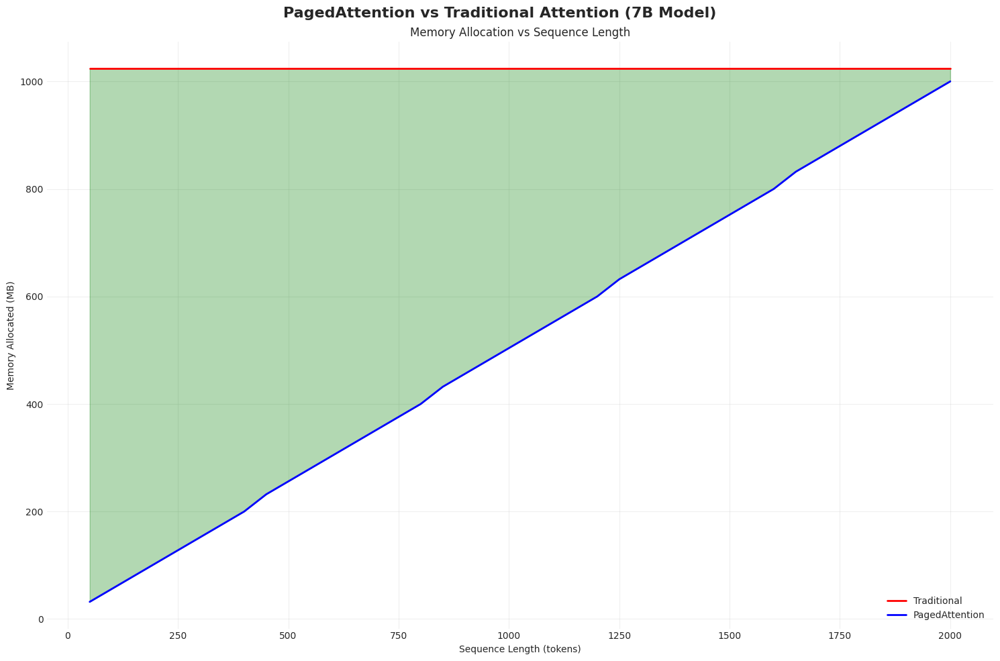

# vLLm_PagedAttention_vs_TraditionalAttention

## The Memory Revolution in LLMs

<div align="center">
Paged Attention — a clever memory optimization that helps big LLMs run faster and leaner in production, especially via frameworks like vLLM.
</div>

---

## Traditional Attention vs Paged Attention Visualizations:


## 🔥 **The Problem That Costs Millions**

Traditional attention mechanisms are like **booking an entire hotel for one guest**. They pre-allocate maximum memory (2048 tokens) even for a simple "Hi!" (2 tokens). 
In transformer-based LLMs, the attention mechanism requires storing Key-Value (KV) pairs for all previous tokens. Traditional implementations pre-allocate memory for the maximum sequence length.

**Result?** 

- 💸 **Memory Waste:** Average query uses 100-200 tokens, but allocates for 2048
- 🚫 **Poor Batching:** Can't fit many sequences due to over-allocation
- 💰 **No Sharing:** Each sequence gets isolated memory, no reuse

## ✨ **Enter PagedAttention: The Game Changer**

Developed by vLLM, PagedAttention treats memory like **Lego blocks** - use only what you need, when you need it.

<div align="center">
<table>
<tr>
<td align="center"><b>🏚️ Traditional Attention</b></td>
<td align="center"><b>🏗️ PagedAttention</b></td>
</tr>
<tr>
<td>

```python
# Always allocates MAX
memory = allocate(2048)  # tokens
actual_use = 100         # tokens
wasted = 1948           # 95% waste!
```

</td>
<td>

```python
# Allocates only needed pages
pages = ceil(100/16)     # 7 pages
memory = pages * 16      # 112 tokens
wasted = 12             # 11% waste!
```

</td>
</tr>
</table>
</div>


## 🎮 **Try It Yourself**

### **Quick Start**

```bash
# Clone the revolution
git clone https://github.com/ashishmokalkar/vLLm_PagedAttention_vs_TraditionalAttention.git
cd vLLm_PagedAttention_vs_TraditionalAttention

# Run the jupyter notebook 
jupyter PagedAttention_vs_Trad_Attention.ipynb

```

## 💡 **Key Insights from the Code**

### **1. The Allocation Strategy**

```python
class TraditionalAttention:
    def allocate(self, tokens):
        # Always wastes memory
        return {
            'allocated': 2048,  # Always MAX
            'used': tokens,
            'wasted': 2048 - tokens
        }

class PagedAttention:
    def allocate(self, tokens):
        # Smart allocation
        pages = math.ceil(tokens / 16)
        return {
            'allocated': pages * 16,  # Only what's needed
            'used': tokens,
            'wasted': (pages * 16) - tokens  # Minimal waste
        }
```

</details>

## 📈 **Performance Visualizations**

<div align="center">

</div>

## 📚 **Understanding the Algorithm**

### **The Problem**
LLMs store key-value (KV) caches for attention computation. Traditional methods reserve maximum space upfront.

### **The Solution**
PagedAttention uses **virtual memory paging**:

1. **Divide into Pages**: Split KV cache into 16-token blocks
2. **On-Demand Allocation**: Allocate pages only when needed
3. **Page Sharing**: Multiple sequences can share common prefixes
4. **Page Table Management**: Map logical to physical pages

### **Why It's Revolutionary**
- **Fine-grained**: 16-token pages vs 2048-token blocks
- **Dynamic**: Grows with actual usage
- **Shareable**: Common prompts share memory

## 🎯 **Use Cases**

Perfect for:
- 🏢 **Production LLM Serving** - Maximize throughput
- 💰 **Cost Optimization** - Reduce GPU requirements
- 🚀 **Startups** - Serve more users with less hardware
- 📊 **Research** - Memory efficiency studies


## 🙏 **Acknowledgments**

- **vLLM Team** - For inventing PagedAttention
- **UC Berkeley** - For the groundbreaking research
- **Open Source Community** - For continuous improvements

**Found this helpful?** ⭐ Star this repo!  
**Have questions?** 💬 Open an issue!  
**Want to contribute?** 🤝 PRs welcome!

</div>

## 📄 **License**

Apache License - feel free to use this in your own projects!

---
